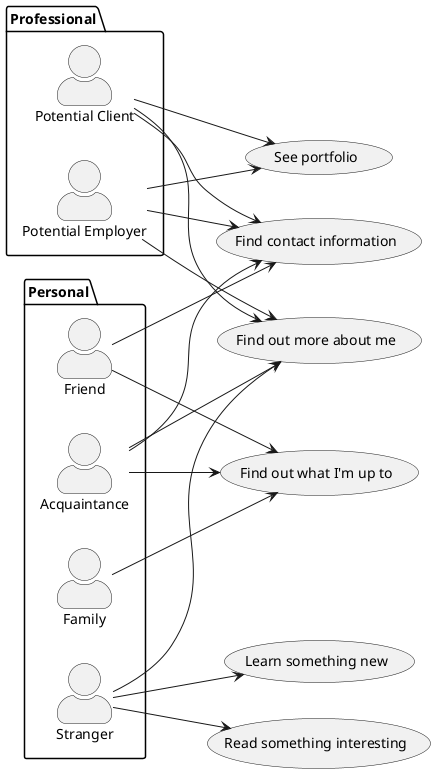

# Use Case Diagram

```plantuml
@startuml
left to right direction
skinparam actorStyle awesome

package Professional {
    actor :Potential Client: as Client
    actor :Potential Employer: as Employer
}

package Personal {
    actor :Friend:
    actor :Family:
    actor :Acquaintance:
    actor :Stranger:
}

"See portfolio" as (UseCase01)
"Find contact information" as (UseCase02)
"Find out more about me" as (UseCase03)
"Learn something new" as (UseCase04)
"Read something interesting" as (UseCase05)
"Find out what I'm up to" as (UseCase06)

:Friend: --> (UseCase06)
:Friend: --> (UseCase02)
:Family: --> (UseCase06)
:Acquaintance: --> (UseCase03)
:Acquaintance: --> (UseCase02)
:Acquaintance: --> (UseCase06)
(Client) --> (UseCase01)
(Client) --> (UseCase02)
(Client) --> (UseCase03)
(Employer) --> (UseCase01)
(Employer) --> (UseCase02)
(Employer) --> (UseCase03)
:Stranger: --> (UseCase04)
:Stranger: --> (UseCase05)
:Stranger: --> (UseCase03)

@enduml
```